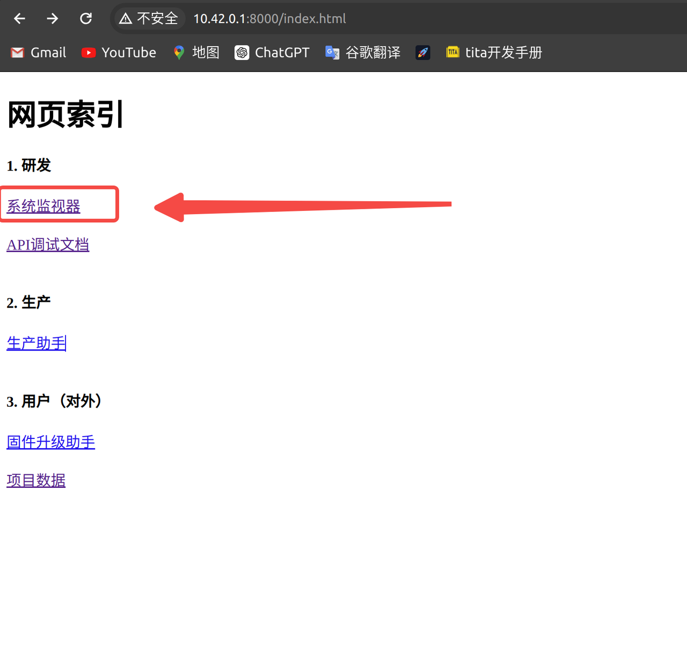
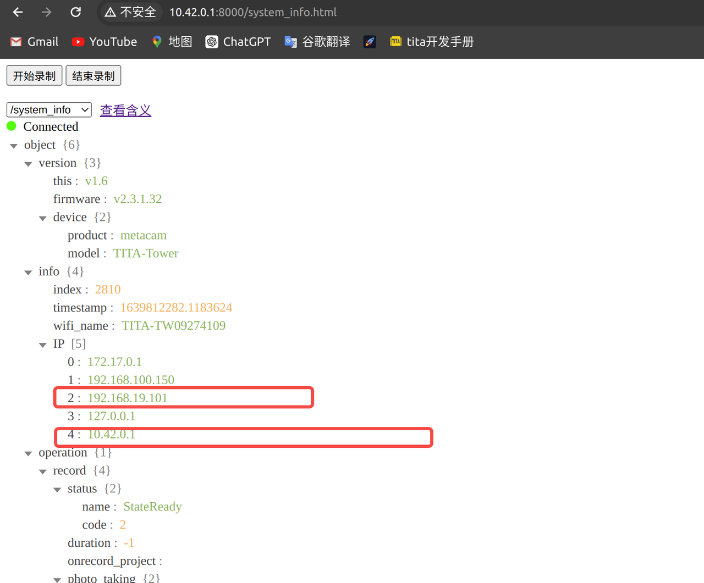

# 导航塔使用手册

```{toctree}
:maxdepth: 1
:glob:
```

------

## 1. 快速开始

### 1.1 准备工作

在使用导航塔之前，需要做以下准备工作：

- **安装、供电**
  导航塔通过TITA本身的DB25的外接接口供电，需要使用官方认证DB25连接线。
  注意，禁止对DB25接口进行热插拔，否则会造成导航塔异常断电。

- **调试**
  导航塔支持以太网接口，通过网线连接导航塔和笔记本电脑，支持多机交互可视化调试。

- **查看IP**
  查看IP可以通过连接热点访问导航塔设备信息网页：[http://10.42.0.1:8000](http://10.42.0.1:8000)
  
   
  - 注意：
    - `192.168.19.101` 为有线网口分配IP
    - `10.42.0.1` 为无线wifi分配的IP

### 1.2 环境配置

- **导航塔 ROS_DOMAIN_ID 默认是42**，实现多机交互需要对调试机的 ROS_DOMAIN_ID 也设置成42，设置完成后，执行 `source ~/.bashrc`

#### 1.2.1 测试设备通讯

开机后，导航塔上电，工作指示灯为蓝色，即待机状态，使用 `ros2 topic list`，可以看到以下话题：
 

## 2. 软件控制

### 开启软件功能

```plaintext
bool success
string message
```
`ros2 service call start std_srvs/srv/Trigger "{}"`
 

### 关闭软件功能

```plaintext
---
bool success
string message
```
`ros2 service call stop std_srvs/srv/Trigger "{}"`
 

### 实时输出

- **能够提供一个高精度的里程计信息**
  ```plaintext
  nav_msgs/msg/Odometry
  ros2 topic echo mapping/odometry
  ```

- **RTK的经纬度信息（国内）**
  ```plaintext
  sensor_msgs/msg/NavSatFix
  ros2 topic echo rtk/gnss_soln
  ```

- **GPS的经纬度信息（国外）**
  ```plaintext
  sensor_msgs/msg/NavSatFix
  ros2 topic echo gps/gnss_soln
  ```

- **彩色建图点云数据**
  ```plaintext
  sensor_msgs/msg/PointCloud2
  ros2 topic echo cloud_colored
  ```

- **左侧相机压缩数据**
  ```plaintext
  sensor_msgs/msg/CompressedImage
  ros2 topic echo camera/left/jpeg
  ```

- **右侧相机压缩数据**
  ```plaintext
  sensor_msgs/msg/CompressedImage
  ros2 topic echo camera/right/jpeg
  ```

- **左侧相机预览数据**
  ```plaintext
  sensor_msgs/msg/Image
  ros2 topic echo camera/left/preview
  ```

- **右侧相机预览数据**
  ```plaintext
  sensor_msgs/msg/Image
  ros2 topic echo camera/right/preview
  ```

### 启动rviz

```plaintext
1 rviz2
```
 


